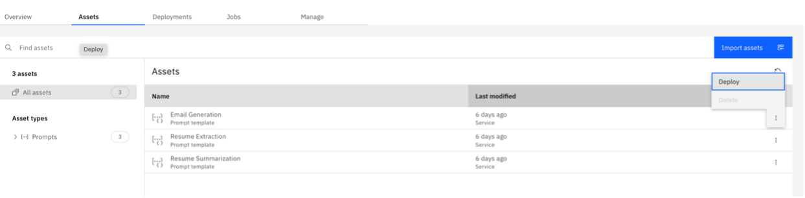

# AutoAI Experimentation

## Prerequisites
- Create a Cloud Pak for Data Project

## Create an AutoAI Experiment
    - Upload training dataset [Example Classification training dataset](../../assets/datasets/Classification train.csv)
    - Select **Binary Classification** for Prediction Type
    - Select **Hired** for Positive Class
    - Click **Run Experiment**
    
    More advanced settings can be found in **Experiment Settings** (Ex: train/test split percentages)

AutoAI experiments will take different lengths of time to run depending on the size of the training dataset and the models being trained. After AutoAI finishes running the experiment, it will provide a list of different models with algorithm, accuracy, enhancements, and build time information. 

## Deploy an AutoAI Model
- Select a model and you can save it to project. 
- Once saved to project, then promote the model to space.

- When in space, deploy the model.

## Add to Watson OpenScale Dashboard for Monitoring
- Go to Watson OpenScale 

- Click **Add to Dashboard**

- Select model deployment space. This is the deployment space that has the AutoAI Experiment.

- Add new machine learning provider by filling out Machine learning provider name, description, and environment type. Production type is needed for Drift Monitoring.

- Select the AutoAI model you deployed previously

- Ensure the data type and algorithm type are correct

- Click **View Summary**
- Ensure everything is accurate and select **Finish** 

- Now you have successfully created and deployed an AutoAI model that has been added to Watson OpenScale for monitoring.
- Click "Finish" and you will see a view similar to this once the the processing is complete.
