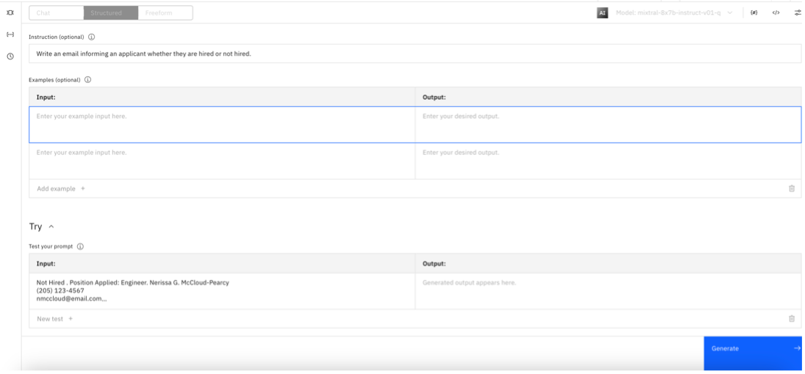
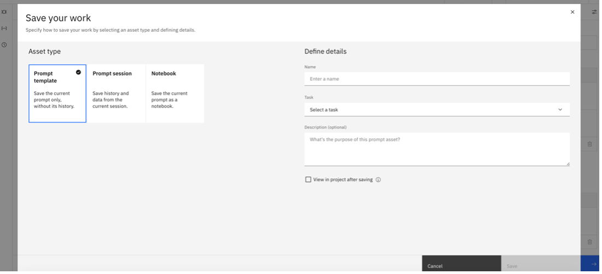
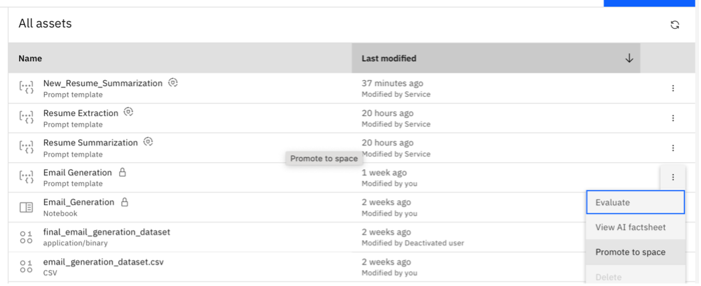
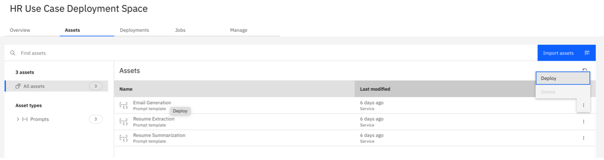
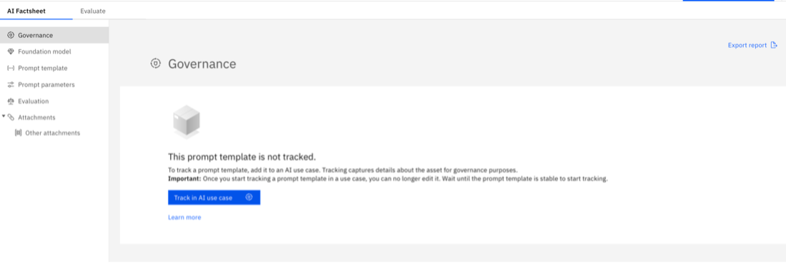
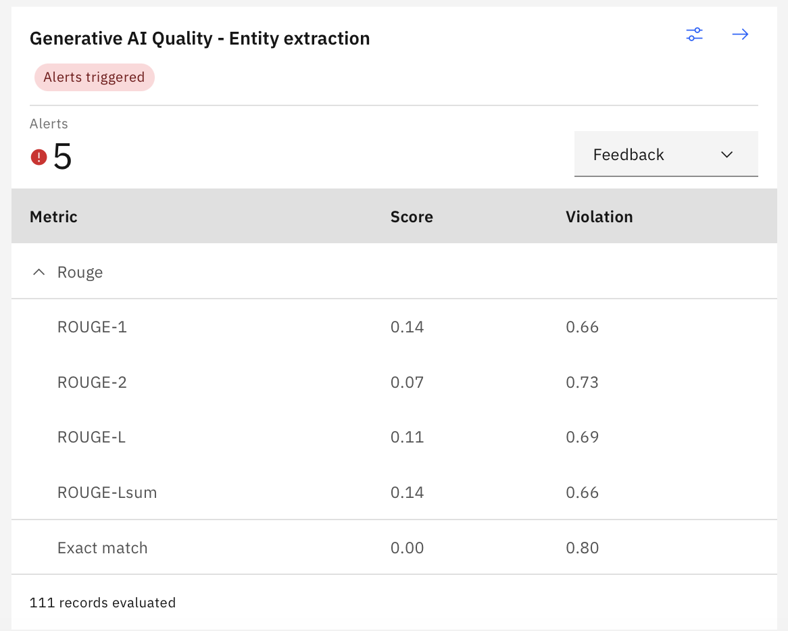
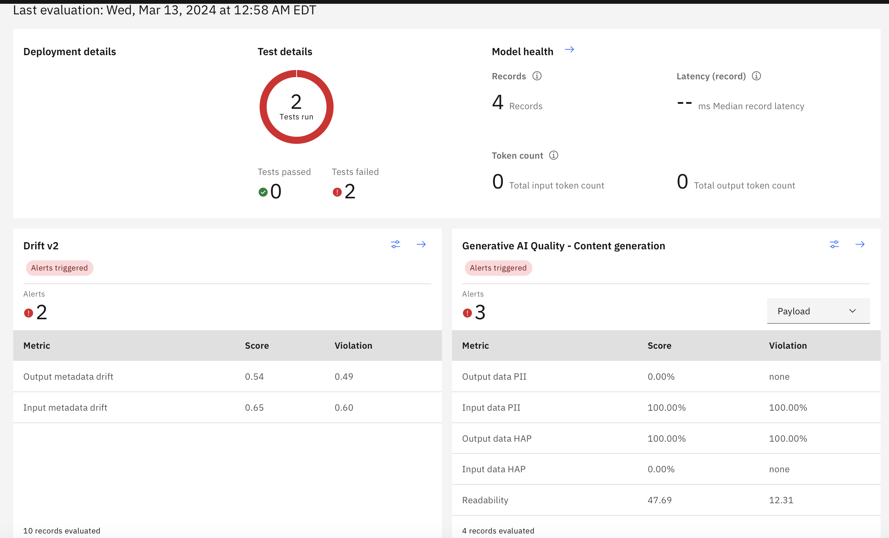
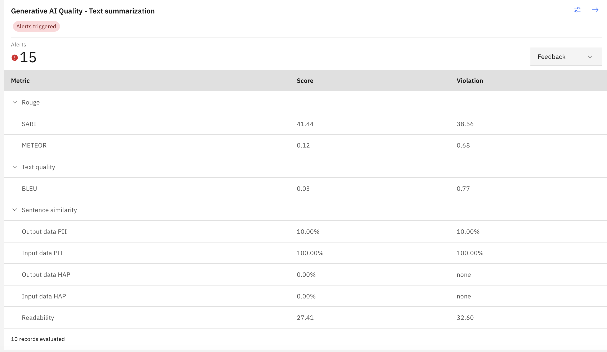

# Evaluate Watsonx.ai models
## Prerequisites
- Create a watsonx.ai instance

## Instructions
- Write a prompt in prompt lab.

- Save as a prompt template.

- Promote prompt to space

- Deploy 

- View in AI Factsheet and Track in AI Use Case

- Evaluate using the payload and/or feedback datasets
- Example dataset:
    - [Resume Extraction example](../../assets/datasets/Resume Extraction example.csv)
    - [Resume Summarization feedback data example](../../assets/datasets/Resume Summarization feedback data example.csv)
    - [Resume Summarization payload data example](../../assets/datasets/Resume Summarization payload data example.csv)

## Metrics Interpretation
- Extraction
    - ROUGE scores

- Generation
    - Readability score
    - HAP score

- Summarization
    - ROUGE scores

## Reference: 
- [Configuring generative AI quality evaluations](https://dataplatform.cloud.ibm.com/docs/content/wsj/model/wos-monitor-gen-quality.html?context=wx&audience=wdp#supported-generative-ai-quality-metrics)
