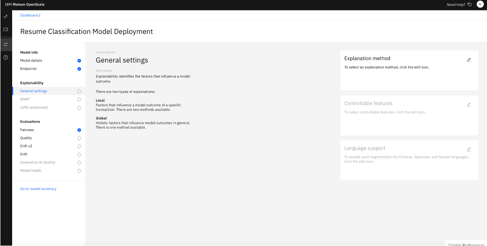
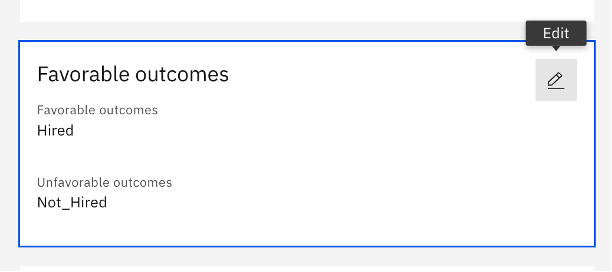
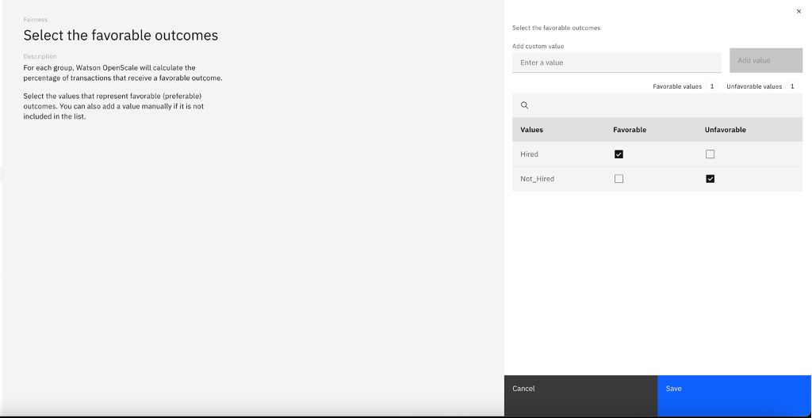
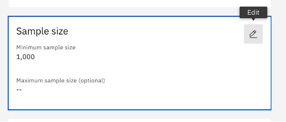
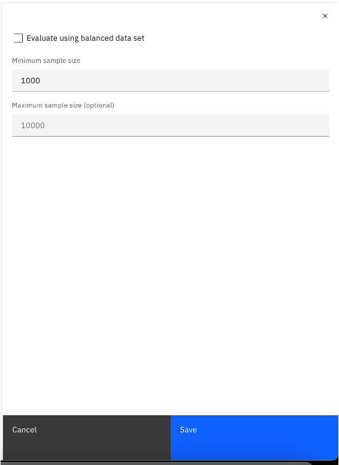
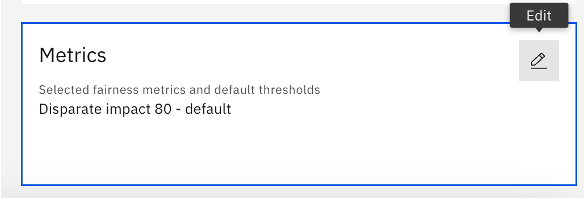
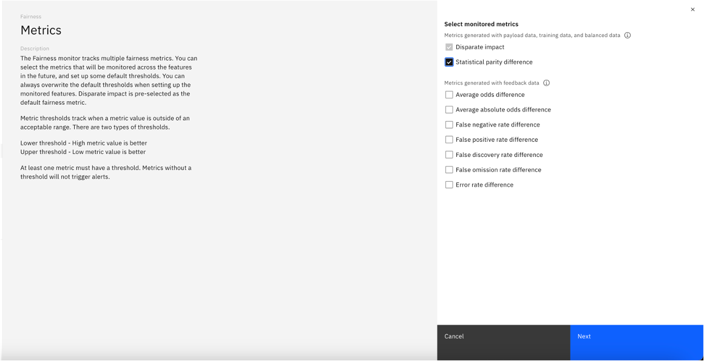
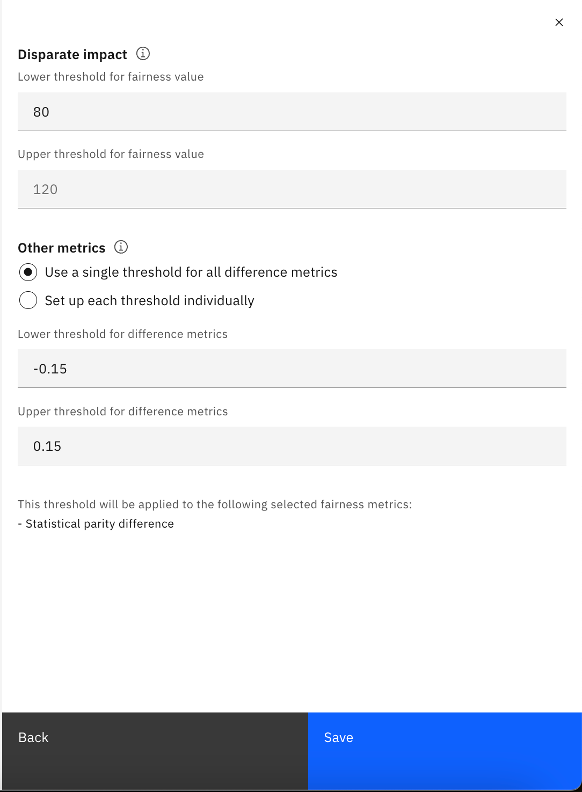

## Prerequisites
- [Finished AutoAI Experimentation](./AutoAI%20Experimentation)
 
## Instructions
### **Configure Model Info**
- Click on your model Yonce you've added the model to OpenScale. Click the blue button “Actions” and select “Configure monitors”

- You will see the following configuration view. Click “Edit” on the upper right hand corner for the "Training data" box.

- Select “Use manual setup” and click “Next”

- To setup the monitoring, we would need to provide training data and specify what are the data features that we want to monitor on. For Training data option, select “Upload file” from the dropdown list as we will be uploading a training dataset in this example. Browse the training dataset file, select “Comma” from the dropdown for Select delimiter, as the csv file is being separated by comma. Click ”Next”.

- You will see this view with the data column information in the submitted training dataset. Scroll down and make sure that “Decision” is checked for “Label / Target” as that’s the targeted prediction field. Click “Next”

- Ensure the prediction and probability are clicked accordingly. Click “View Summary”

- You will see this summary view, click “Finish”

### **Configure Explainability Metrics**
-  After last step in Configure Model Info section, you will now see this view with the training data attached and the data labels specified.

- We first configure Explanability. To configure monitoring metrics for explanability, on the left hand side panel, navigate to “General settings” under Explainability. Click on the "Edit" icon for "Explanation method" to start configuration.  

- Explanation method: In our example, we will set the SHAP global explanation to “On” and select “SHAP” for Local explanation method. Click “Next”.

- We need to select Controllable features for explanability. Controllable features are features that can be changed and have a significant impact on your model outcomes. In our example, we set all features as controllable, and click “Save”

- Once we selected "SHAP" for Explanation method, we will need to configure the SHAP tab. Navigate to the SHAP tab and click the "Edit" icon for "Common Settings" to start configuration.

- Set the number of perturbations per record. In our example we use the default value 0. Click ”Save”. For more information about SHAP model, click here: [Configuring explainability in Watson OpenScale](https://dataplatform.cloud.ibm.com/docs/content/wsj/model/wos-explainability-config.html?context=cpdaas)

### **Configure Evaluation Metrics (e.g. Fairness, Quality)**
- To configure Fairness, navigate to the ”Fairness” tab under Evaluations. 
    - Click “Edit” icon for "Configuration" to configure the metrics. Select “Configure manually” and click “Save”.  
    
    - Next, click “Edit” icon for Favorable outcomes to configure. 
    
    - Configure the Favorable outcomes by selecting the checkboxes according to the use case. In our example, “Hired” is the favorable outcome and “Not_Hired” is the unfavorable outcomes. Click “Save”.  
    
- Next, we configre "Sample Size". Click “Edit” icon for "Sample Size" to start configuration. 
    
- Set the minimum sample size to a number equal or smaller than the testing data, in our example, we set it as 1000. Click “Save”.  

- Next, click “Edit” icon for "Metrics" to configure Metrics. 

- Select metrics that you’d like to monitor. In our example, we additionally select “Statistical parity difference”. Click “Save”. 

- We could then set the lower and upper threshold for fairness value. In our example, we use the default value. Click “Save” to finish the setup.  

- For more information about Configuring fairness evaluations, click here: [Configuring fairness evaluations in Watson OpenScale](https://dataplatform.cloud.ibm.com/docs/content/wsj/model/wos-monitor-fairness.html?context=cpdaas&audience=wdp)

