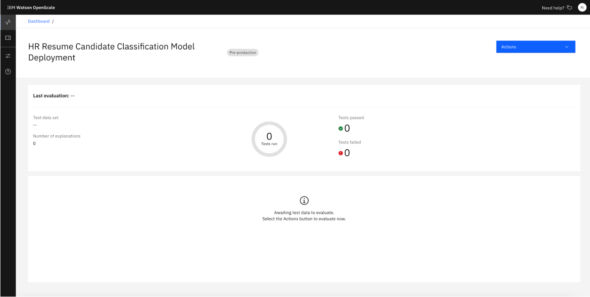

## Prerequisites
- [Finished AutoAI Experimentation](./AutoAI%20Experimentation)
 
## Instructions
### Configure Model Info
- Click on your model Yonce you've added the model to OpenScale. Click the blue button “Actions” and select “Configure monitors”

- You will see the following configuration view. Click “Edit” on the upper right hand corner for the "Training data" box.

- Select “Use manual setup” and click “Next”

- To setup the monitoring, we would need to provide training data and specify what are the data features that we want to monitor on. For Training data option, select “Upload file” from the dropdown list as we will be uploading a training dataset in this example. Browse the training dataset file, select “Comma” from the dropdown for Select delimiter, as the csv file is being separated by comma. Click ”Next”.

- You will see this view with the data column information in the submitted training dataset. Scroll down and make sure that “Decision” is checked for “Label / Target” as that’s the targeted prediction field. Click “Next”

- Ensure the prediction and probability are clicked accordingly. Click “View Summary”

- You will see this summary view, click “Finish”

### Configure Explainability Metrics

### Configure Evaluation Metrics (e.g. Fairness, Quality)

